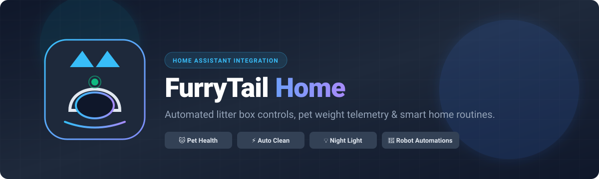

<p align="center">
  
</p>

<p align="center">
  <a href="https://github.com/hacs/default"></a>
  <a href="https://github.com/CamiloValderruten/hass-furrytail/releases"></a>
  <a href="https://www.home-assistant.io/"></a>
  <a href="https://www.python.org/"></a>
  <a href="LICENSE"></a>
</p>

---

## Overview

**FurryTail for Home Assistant** brings seamless local smart home automation and real-time telemetry to the **FurryTail PF001 Smart Automatic Cat Litter Box** (powered by the Granwin / 吾尾 IoT cloud).

Reverse-engineered from mobile IoT traffic, this custom integration unlocks complete control of your litter box within Home Assistant—enabling pet health tracking, remote cycle triggers, dimmable lighting, and intelligent multi-device routines (like automatic robot vacuum spot cleaning after cat visits).

<p align="center">
  <a href="https://my.home-assistant.io/redirect/hacs_repository/?owner=CamiloValderruten&repository=hass-furrytail&category=integration">
    
  </a>
</p>

---

## ✨ Features

### 🐱 Pet Health & Visit Telemetry
- **Visit Tracking:** Real-time timestamp of the last visit, duration (seconds), and cat weight (grams).
- **Pet Profiles:** Dedicated weight sensors for each registered pet profile in your FurryTail household.
- **Visit Identification:** Matches visit events directly to individual pets.

### 🔄 Device Controls & Commands
- **Manual Clean:** Trigger an immediate cleaning cycle directly from Home Assistant or dashboards.
- **Litter Flattening:** Smooth and level fresh litter across the drum.
- **Empty / Change Litter:** Dump litter into the waste drawer for quick maintenance.

### 💡 Smart Chamber Lighting
- **Dimmable Light Entity:** Full 0–100% brightness control of the internal night light (`light.furrytail_night_light`).
- **Automation Ready:** Turn the chamber light on at bedtime or when motion is detected near the enclosure.

### 📡 Diagnostic & System Monitoring
- **Connectivity:** Real-time cloud connection status (`binary_sensor.furrytail_online`).
- **Operational State:** Live indication of active cleaning cycles (`binary_sensor.furrytail_cleaning`).
- **Settings & Firmware:** Monitor auto-clean delay interval and Wi-Fi / MCU firmware versions.

---

## 📦 Entity Reference

| Domain | Entity | Type | Description |
| :--- | :--- | :--- | :--- |
| `binary_sensor` | **Online** | Connectivity | Cloud connection state of the litter box |
| `binary_sensor` | **Cleaning** | Running | Active cleaning / cycle state (DP 2) |
| `sensor` | **Last visit** | Timestamp | Date & time of the most recent visit |
| `sensor` | **Last visit duration** | Duration (`s`) | Time spent inside the litter box during last visit |
| `sensor` | **Last visit weight** | Weight (`g`) | Measured weight from the most recent visit |
| `sensor` | **Last visit pet** | Text | Pet name associated with the last visit |
| `sensor` | **[Pet Name] weight** | Weight (`g`) | Recorded weight per pet profile |
| `sensor` | **Clean delay** | Time (`min`) | Configured delay before auto-cleaning begins |
| `sensor` | **WiFi firmware** | Diagnostic | Current Wi-Fi module firmware version |
| `sensor` | **MCU firmware** | Diagnostic | Current MCU board firmware version |
| `light` | **Night light** | Brightness | Dimmable chamber light (0–100%) |
| `button` | **Clean** | Command | Triggers an immediate cleaning cycle |
| `button` | **Flatten** | Command | Levels and flattens the litter bed |
| `button` | **Empty** | Command | Empties litter into the waste bin |

---

## 🚀 Getting Started

### ⚠️ Important: Multi-Account Setup
FurryTail’s cloud enforces a **single active session per account**. Logging in via Home Assistant will log out the official mobile app if using the same credentials.

> [!TIP]
> **Recommended Solution:**
> 1. Create a second FurryTail account with a separate email address (*note: `+` alias emails are not supported by FurryTail*).
> 2. In your primary FurryTail mobile app, navigate to **Home Settings → Share Home / Members** and invite the second account.
> 3. Use the credentials of the second account when setting up this Home Assistant integration. Both the mobile app and Home Assistant will remain logged in simultaneously!

---

### Installation

#### Option 1: HACS (Recommended)

Click the button below to add this repository directly to your HACS installation:

[](https://my.home-assistant.io/redirect/hacs_repository/?owner=CamiloValderruten&repository=hass-furrytail&category=integration)

**Or add manually via HACS:**
1. Open **HACS** in your Home Assistant UI.
2. Click the three dots **⋮** in the top right → **Custom repositories**.
3. Enter `https://github.com/CamiloValderruten/hass-furrytail` with category **Integration**.
4. Search for **"FurryTail"** and click **Download**.
5. **Restart Home Assistant**.

#### Option 2: Manual Installation
1. Download the latest release `.zip` or clone this repository.
2. Copy the `custom_components/furrytail` folder into your Home Assistant `<config_dir>/custom_components/` directory.
3. **Restart Home Assistant**.

---

### Configuration

1. In Home Assistant, navigate to **Settings → Devices & Services**.
2. Click **+ Add Integration** in the bottom right corner.
3. Search for **"FurryTail"**.
4. Enter your FurryTail account **Email** and **Password** (use your dedicated secondary account).
5. Click **Submit**. Your litter box and pet sensors will be discovered automatically!

---

## 💡 Automation Recipes

### 1. 🤖 Robot Vacuum Spot-Clean After 3 Cat Visits
Automatically vacuum the litter box enclosure area every 3 cat visits to keep floors clean:

```yaml
alias: "Litter Box: Spot Clean After 3 Visits"
description: "Triggers robot vacuum spot sweep around the litter box after every 3 visits"
trigger:
  - platform: state
    entity_id: sensor.furrytail_litter_box_last_visit
condition:
  - condition: state
    entity_id: binary_sensor.furrytail_litter_box_cleaning
    state: "off"
action:
  - action: counter.increment
    target:
      entity_id: counter.cat_litter_visits
  - choose:
      - conditions:
          - condition: numeric_state
            entity_id: counter.cat_litter_visits
            above: 2
        sequence:
          # Wait until no cats are nearby and machine is idle
          - wait_for_trigger:
              - platform: state
                entity_id: binary_sensor.furrytail_litter_box_cleaning
                state: "off"
            timeout: "00:10:00"
          - action: vacuum.send_command
            target:
              entity_id: vacuum.robot_vacuum
            data:
              command: "spot_clean"
              params:
                zone: "Litter Box Enclosure"
          - action: counter.reset
            target:
              entity_id: counter.cat_litter_visits
```

---

### 2. 📱 Cat Visit & Weight Notification
Receive a mobile push notification with pet name, duration, and weight after each visit:

```yaml
alias: "Litter Box: Pet Visit Notification"
description: "Send push notification when a cat finishes using the litter box"
trigger:
  - platform: state
    entity_id: sensor.furrytail_litter_box_last_visit
condition:
  - condition: template
    value_template: "{{ trigger.from_state.state not in ['unknown', 'unavailable', None] }}"
action:
  - action: notify.notify
    data:
      title: "🐱 Litter Box Visit Recorded"
      message: >
        {{ states('sensor.furrytail_litter_box_last_visit_pet') }} just visited the litter box!
        Duration: {{ states('sensor.furrytail_litter_box_last_visit_duration') }}s
        Weight: {{ (states('sensor.furrytail_litter_box_last_visit_weight') | float / 1000) | round(2) }} kg
```

---

### 3. 🌙 Night-Light Schedule
Turn on the soft chamber night light at sunset and dim to 30%:

```yaml
alias: "Litter Box: Night Light Auto On"
trigger:
  - platform: sun
    event: sunset
action:
  - action: light.turn_on
    target:
      entity_id: light.furrytail_litter_box_night_light
    data:
      brightness_pct: 30
```

---

## 🛠️ Engineering & Architecture

This integration was built by reverse-engineering the FurryTail Home iOS application communication flow using `mitmproxy` and inspecting IoT payloads.

```
┌─────────────────────────┐          HTTPS / REST (JWT)          ┌─────────────────────────┐
│   Home Assistant Core   │ ───────────────────────────────────> │  FurryTail Cloud API    │
│  (DataUpdateCoordinator)│ <─────────────────────────────────── │(app.prod-iot.furrytail) │
└────────────┬────────────┘                                      └────────────┬────────────┘
             │                                                                │
             ▼                                                                ▼
┌─────────────────────────┐                                      ┌─────────────────────────┐
│ Exposed HA Entities     │                                      │  FurryTail Smart Box    │
│ (Sensors, Lights, DPs)  │                                      │      (Model PF001)      │
└─────────────────────────┘                                      └─────────────────────────┘
```

- **Asynchronous Architecture:** Non-blocking I/O using Python’s `asyncio` and Home Assistant’s `DataUpdateCoordinator`.
- **Typed Cloud Datapoints:** Interacts with FurryTail datapoints (DP 2, 3, 4, 5, 20, 21, 22) through authenticated REST commands.
- **Automated Releases:** Semantic versioning and changelogs generated automatically via [Release Please](https://github.com/googleapis/release-please).
- **Reverse-Engineering Documentation:** Comprehensive protocol analysis and captured schemas are documented in [`docs/api-notes.md`](docs/api-notes.md).

---

## 🧪 Development & Testing

Run the test suite locally:

```bash
# Run all unit tests
python -m unittest discover -s tests -v
```

### Project Structure
```text
custom_components/furrytail/
├── __init__.py          # Integration lifecycle & coordinator setup
├── api.py               # Asynchronous FurryTail cloud client
├── binary_sensor.py     # Connectivity & cycle-state binary sensors
├── button.py            # Clean, flatten, and empty command buttons
├── config_flow.py       # UI-based user authentication & onboarding
├── const.py             # Datapoints, constants, and API endpoints
├── coordinator.py       # DataUpdateCoordinator polling engine
├── light.py             # Dimmable night light entity
├── manifest.json        # Integration metadata & requirements
└── strings.json         # UI translations and config flow strings
```

---

## 🤝 Contributing

Contributions, issues, and feature requests are welcome! Feel free to check the [issues page](https://github.com/CamiloValderruten/hass-furrytail/issues).

1. Fork the project.
2. Create your feature branch (`git checkout -b feature/amazing-feature`).
3. Commit your changes using [Conventional Commits](https://www.conventionalcommits.org/) (`git commit -m 'feat: add support for waste drawer sensor'`).
4. Push to the branch (`git push origin feature/amazing-feature`).
5. Open a Pull Request.

---

## 📄 License

Distributed under the MIT License. See [`LICENSE`](LICENSE) for more information.

---

<p align="center">
  Crafted with ❤️ by <a href="https://github.com/CamiloValderruten">Camilo Valderruten</a> • <a href="https://camilovalderruten.com">camilovalderruten.com</a>
</p>
